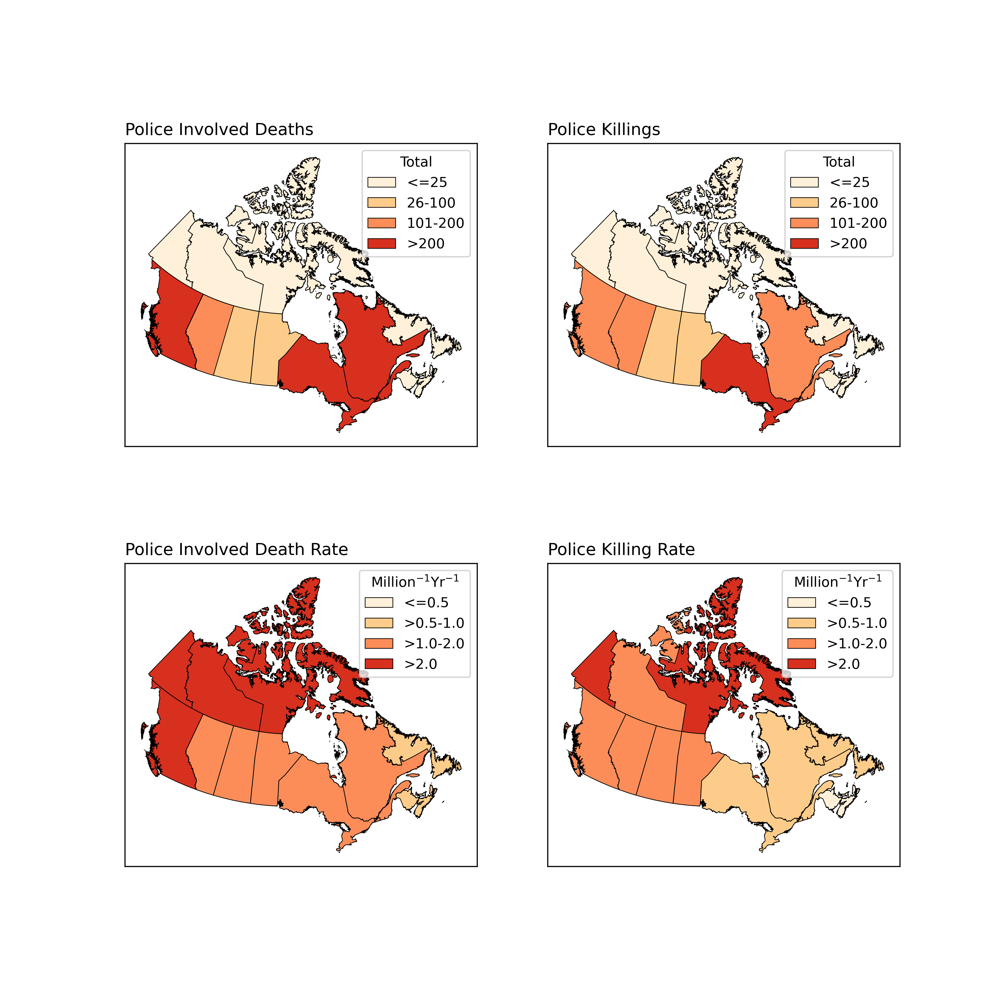

# Police Killings and Police Involved Deaths in Canada

## Annual Trends

## Types of Deaths

## By Province

## Spatial Attribution

  <iframe src="PID.html" title="Processes" scrolling="no" frameborder="0"
    style="border: 0;
   height: 100%;
   left: 0;
   position: absolute;
   top: 0;
   width: 100%;">
   
Your browser does not support iframes.

 </iframe>

<a href="PID.html" target="_blank">View Image in New Tab</a>
