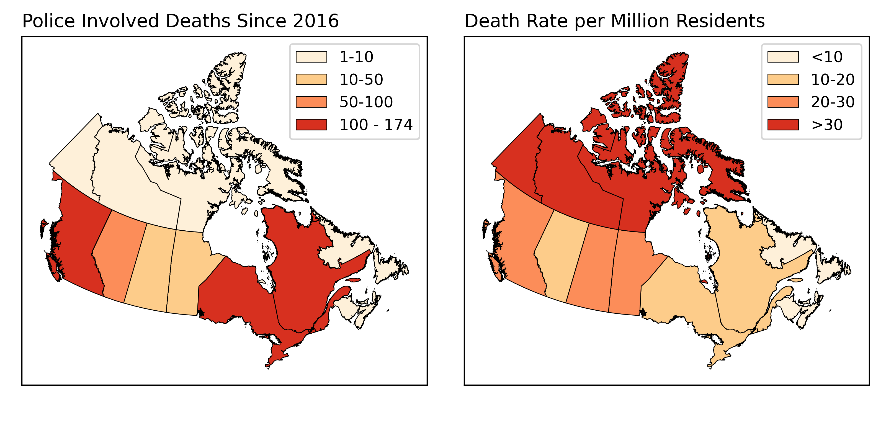
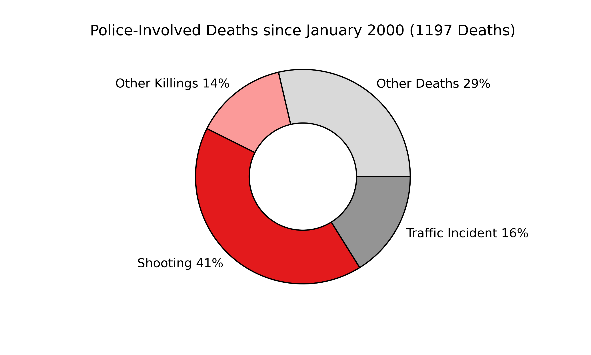
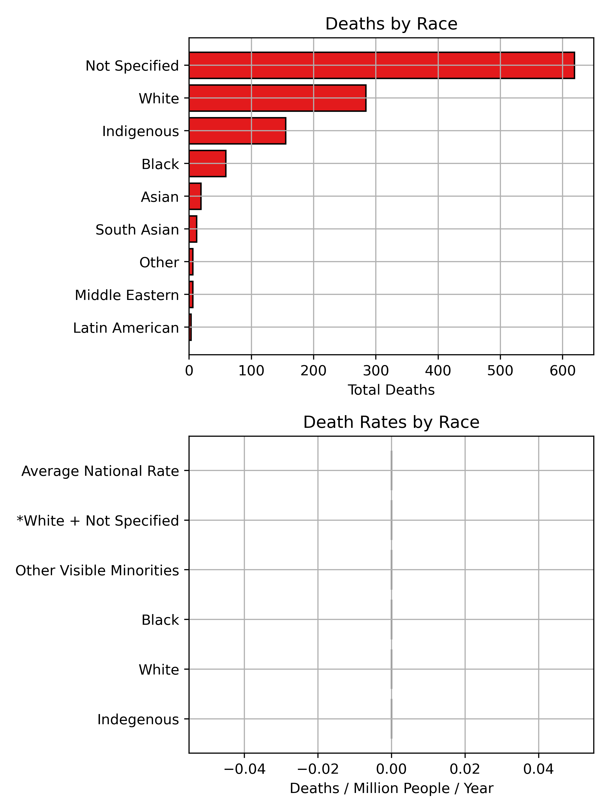
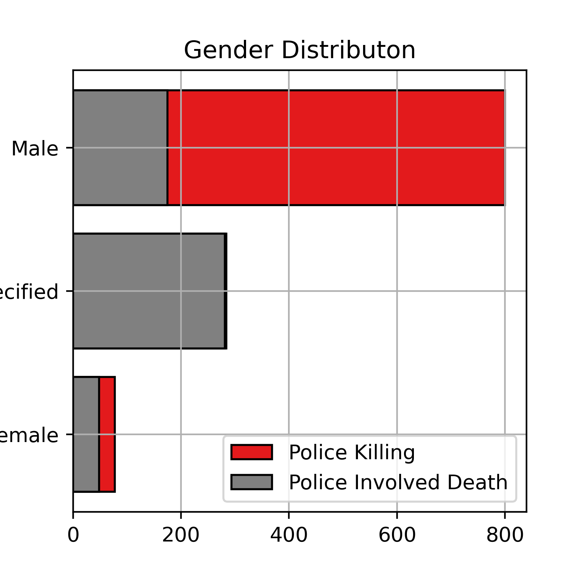
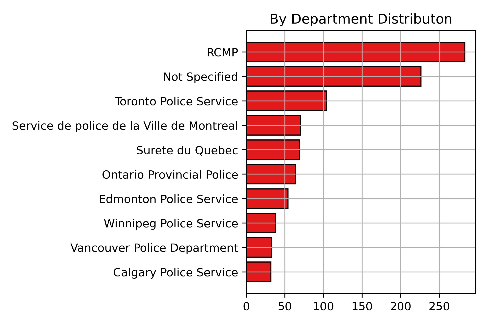

# Police Killings and Police Involved Deaths in Canada
{: .no_toc }

  

    Table of contents
  

  {: .text-delta }
1. TOC
{:toc}

# Why Police-Involved Deaths in Canada?

Racism is ingrained in the history of policing in Canada since the founding of the Royal Canadian Mounted Police (RCMP) in 1873.  Police in Canada play a central tool in Canada's ongoing genocide of Indigenous people, actively work to oppress BIPOC communities, and maintain systems of oppression in Canadian society.  Police institutions exist to do the bidding of those in power, not protect the public.

Canadian institutions rely on the lack of race based statistics and other demographic information to perpetuate a narrative that systemic racism is "just an American issue" and that Canada is "better".  We need to have discussions about systemic racism in Canada and make it part of the public discourse in order to hold Canadian institutions accountable.

# Access the Data

The Canadian Police Killing and Police Involved Deaths data can be accessed [here](https://github.com/Police-Involved-Deaths-CA/Data/tree/main/MostRecentUpdate).

## Notes on Terminology
{: .no_toc }

**Police Killing:** A death directly resulting from police use of force.  Including but not limited to: shooting, tazing, other use of force.

**Police-Involved Deaths**  Any civilian death at the hands of police or in the custody of police.  Includes police killings deaths resulting from police negligence/inaction: suicide, overdoses, medical emergencies, etc.  This is broader term that is more difficult to refute on the grounds of semantics.  

# Spatial Distribution

## By Province
{: .no_toc }

Ontario and Quebec have the highest numbers, but if normalizing by population highlights that the RCMP, police in the North and West are more predisposed to violence.

## Point Locations
{: .no_toc }

  <iframe src="Police_Involved_Deaths.html" title="Processes" scrolling="yes" frameborder="0"
    style="border: 0;
   height: 100%;
   left: 0;
   position: absolute;
   top: 0;
   width: 100%;">
   
Your browser does not support iframes.

 </iframe>

<a href="Police_Involved_Deaths.html" target="_blank">View page in New Tab</a>

# Trends and Demographics

## Increasing Police Violence in Canada
{: .no_toc }

There has been an alarming increase in deaths at the hands of Canadian Police over recent years.  Some of this trend may be due to increaed access to information.  However, it is doubtufl that more information alone can explain this striking increase.

## Types of Deaths
{: .no_toc }

**Police Shootings** are the largest proportion of deaths in the database.  **Other Killings** include all verified uses of force (tazings, beatings, etc.).  **Traffic Incidents** include deaths resulting from police chases and officers hitting pedestrians.  **Other Deaths** includes deaths in custody, suicides during police action, and those where details were not released. 

## By Race
{: .no_toc }

The racial breakdown of deaths is **severely** uneven.  Minimal information is released about most victims and their race is not specified in over half of incidents.  The information we have highlights that Indigenous and Black individuals are severely over-represented.  Normalizing by national population totals highlights just how sever the disparity is.  **Even** if *All* of the unspecified deaths were white, the death rate would not equal Indigenous or Black individuals.

## By Gender
{: .no_toc }

There is a severe gender disparity in deaths as well, particularly for police involved killings.

# Advocating for Accountability, Attributing Blame

As of 2017 (*the most recent data available*), only 14 officers (3%) had been charged for a killing.  Regardless of whether an officer is charged with a crime, the departments involved are directly responsible for the deaths of these individuals.

## By Department
{: .no_toc }

<!-- 

  <iframe src="PID.html" title="Processes" scrolling="no" frameborder="0"
    style="border: 0;
   height: 100%;
   left: 0;
   position: absolute;
   top: 0;
   width: 100%;">
   
Your browser does not support iframes.

 </iframe>

<a href="PID.html" target="_blank">View Image in New Tab</a>
 -->
