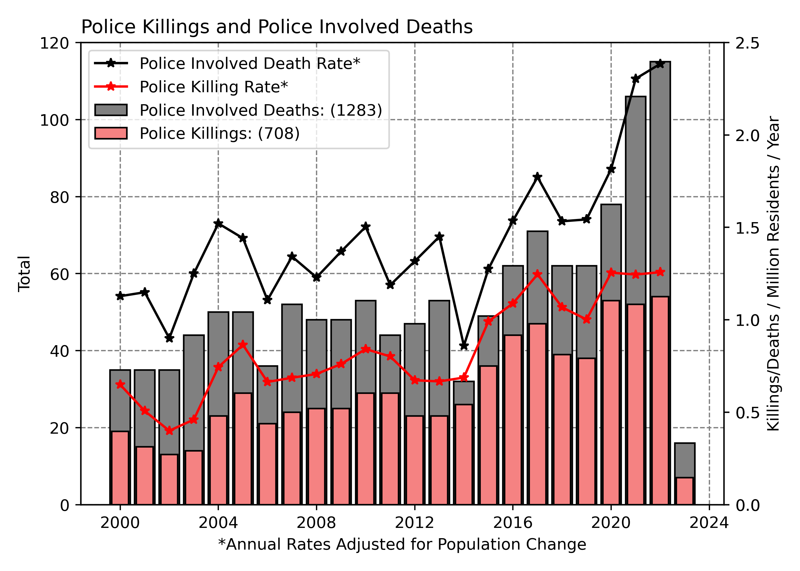

# Police Killings and Police Involved Deaths in Canada
{: .no_toc }

  

    Table of contents
  

  {: .text-delta }
1. TOC
{:toc}

# Why Police-Involved Deaths in Canada?

Racism is ingrained in the history of policing in Canada since the founding of the Royal Canadian Mounted Police (RCMP) in 1873.  Police in Canada play a central tool in Canada's ongoing genocide of Indigenous people, actively work to oppress BIPOC communities, and maintain systems of oppression in Canadian society.  Police institutions exist to do the bidding of those in power, not protect the public.

Canadian institutions rely on the lack of race based statistics and other demographic information to perpetuate a narrative that systemic racism is "just an American issue" and that Canada is "better".  As a white settler and immigrant from the United States, I fell for that narrative and did not question it for years.  
* We need to have discussions about systemic racism in Canada and make it part of the public discourse in order to hold Canadian institutions accountable.

## Notes on Terminology

**Police Killing:** A death directly resulting from police use of force.  Including but not limited to: shooting, tazing, other use of force.

**Police-Involved Deaths**  Any civilian death at the hands of police or in the custody of police.  Includes police killings deaths resulting from police negligence/inaction: suicide, overdoses, medical emergencies, etc.  This is broader term that is more difficult to refute on the grounds of semantics.  

## Increasing Police Violence in Canada

There has been an increasing trend in deaths at the hands of Canadian Police over recent years.  This may be partly an result of greater access to information, but it is also probable that Canadian Police *are* becoming more violent.

## Spatial Distribution

Police in the North and West are More Violent

# Access the Data

The Canadian Police Killing and Police Involved Deaths data can be accessed [here](https://github.com/PoliceKillingsandInolvedDeathsCanada/Data/tree/main/MostRecentUpdate).

## About the Data

This dataset was compiled by June Skeeter: june.skeeter@ubc.ca  Contact me if you have any questions or concerns.  I am a climate scientist and GIS instructor.  I've complied this data in my spare time, because it is an important issue that does not get the attention it deserves.
